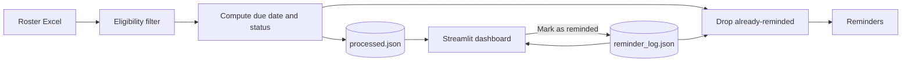

# Annual Health Checkup Reminder

A pipeline and Streamlit dashboard that tracks annual health checkups for hospital staff. It reads an employee roster from Excel, works out when each person's next checkup is due, flags who is **Overdue** or **Due Soon**, and lets HR mark people as reminded so they don't keep reappearing.

> **Status: work in progress.** The pipeline and dashboard run end to end on dummy data. Sending real emails is not implemented yet. See [Known limitations](#known-limitations).

## How it works



1. **Read** the roster from Excel.
2. **Filter** out anyone who has already left (a Last Working Day in the past). Blank means still employed.
3. **Compute** each person's `Due Date` (`Checkup Date` plus `validity` years), then `days_left` and `checkup_status`.
4. **Save** the result to `processed.json`, which the dashboard reads.
5. **Dedup** against `reminder_log.json` so nobody is reminded twice for the same due date.
6. **Dashboard** shows the results and lets HR mark selected rows as reminded.

### Status rules

| Status | Condition |
|---|---|
| Overdue | `days_left <= 0` |
| Due Soon | `1 <= days_left <= 30` |
| OK | `days_left > 30` |

`days_left` is the number of days from today until the `Due Date`.

### How deduplication works

Every reminder is recorded under a key of the form `<Employee ID>_<Due Date>`, for example `HOSP1024_2025-12-20`.

When someone completes a checkup, HR updates their `Checkup Date` in the Excel file. Their `Due Date` changes, so the key changes, and they become eligible for reminders again. Nothing needs to be cleaned up by hand.

## Project structure

```
annual_health_checkup_automation/
├── main_pipeline.py                  # runs the pipeline steps in order
├── compute_pipeline.py               # due date, days_left and status logic
├── dashboard.py                      # Streamlit dashboard
├── utils.py                          # config loading, logging, Excel and JSON helpers
├── config.yaml                       # file paths and column names
├── requirements.txt
├── Hospital_Employee_Roster_Dummy.xlsx   # sample input (dummy data)
├── processed.json                    # generated: output of the pipeline
└── reminder_log.json                 # generated: who has been reminded
```

## Input data

The roster must contain these columns (exact header text):

| Column | Meaning |
|---|---|
| `Employee ID` | Unique ID, used in the reminder key |
| `Employee Name` | |
| `Department` | Used by the dashboard filter |
| `Designation / Cadre` | |
| `Reporting Manager / HOD` | |
| `Date of Joining (DOJ)` | |
| `Employment Type` | |
| `Checkup Date` | Date of the last completed checkup |
| `validity` | Years between required checkups (for example `1` or `2`) |
| `Last Working Day (LWD)` | Leave blank for current employees |
| `Email ID` | Used when sending reminders |

## Configuration

Paths and column names live in `config.yaml`:

```yaml
Path:
  Filepath: "Hospital_Employee_Roster_Dummy.xlsx"   # input roster
  reminder_log: "reminder_log.json"                 # dedup log
  processed_path: "processed.json"                  # pipeline output
column:
  "last working date": "Last Working Day (LWD)"
  "last checkup date": "Checkup Date"
  "empid": "Employee ID"
  "emp name": "Employee Name"
  "email": "Email ID"
```

Several column names are still hardcoded in the Python files, so renaming a header in your Excel file means updating the code as well as this file.

## Setup

Requires **Python 3.12 or newer** (the code uses nested quotes inside f-strings, which older versions reject).

```bash
cd annual_health_checkup_automation
pip install pandas numpy openpyxl pyyaml streamlit
```

`requirements.txt` currently lists `pandas`, `numpy`, `openpyxl`, `requests` and `schedule`. It is missing `pyyaml` and `streamlit`, and `requests` and `schedule` are not used yet. Update it before sharing the project.

## Usage

Run every command from inside `annual_health_checkup_automation/`, because the paths in `config.yaml` are relative.

**1. Run the pipeline**

```bash
python -m main_pipeline
```

This reads the roster, computes due dates and statuses, and writes `processed.json`.

**2. Open the dashboard**

```bash
streamlit run dashboard.py
```

The dashboard opens at `http://localhost:8501` and provides:

- Summary cards for Overdue, Due Soon, OK and total
- Sidebar filters for department and status
- A date filter
- Rows colour-coded by status
- Row selection with a **Mark Selected as Reminded** button that writes to `reminder_log.json`
- An **Undo Last** button
- A toggle to show or hide rows that were already reminded

To start over with a clean slate, delete `processed.json` and reset `reminder_log.json` to `{}`.

## Known limitations

- **Emails are not sent.** `send_reminders` is a stub that only prints what it would send, and it is currently commented out in `main()`. Real sending (SMTP) is not implemented.
- **Two writers to the reminder log.** The pipeline and the dashboard can both mark people as reminded, and the entries they write use different field names. Pick one as the writer and unify the entry format.
- **Missing checkup dates count as OK.** An employee with no `Checkup Date` gets no `Due Date`, and the status logic falls through to `OK`. They should be flagged as unknown or overdue instead.
- **The dashboard date filter only looks backwards.** It shows people whose `Due Date` is on or before the selected date, so `Due Soon` and `OK` rows may not appear.
- **`reminder_log.json` is not crash-safe.** Writes go straight to the file, so a crash mid-write can leave invalid JSON.
- **No automated tests.**

## Data privacy

`processed.json` and `reminder_log.json` are generated from your roster and will contain employee names, IDs and emails when you use real data. Add them to `.gitignore` so they never reach GitHub, along with your virtual environment:

```gitignore
venv/
__pycache__/
processed.json
reminder_log.json
*.xlsx
!Hospital_Employee_Roster_Dummy.xlsx
```

Only the dummy roster should be committed.